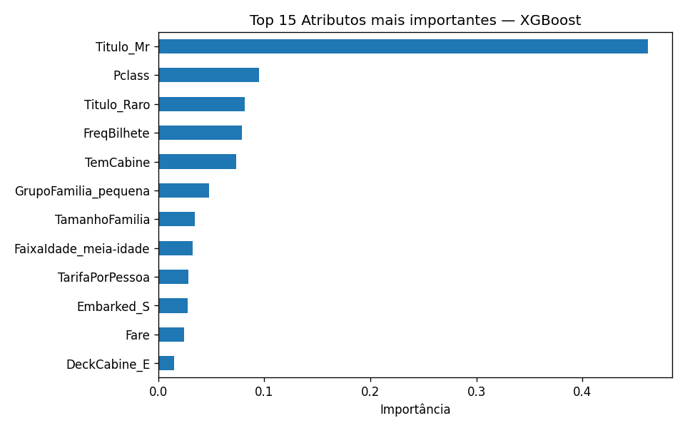

# Titanic — Previsão de Sobrevivência


Solução para a competição [Titanic - Machine Learning from Disaster](https://www.kaggle.com/competitions/titanic) do Kaggle, com pipeline completo de engenharia de atributos, seleção automática via RFECV, ajuste de hiperparâmetros e ensemble de modelos.

---

## Resultado

| Métrica | Valor |
|---|---|
| Acurácia CV (StratifiedKFold, 5 folds) | 84.62% |
| Desvio padrão | ±1.23% |
| Modelo final | XGBoost |

---

## Estrutura do repositório

```
titanic-kaggle/
├── main.ipynb                 # Pipeline completo
├── submissao.csv              # Arquivo de submissão gerado
├── curva_rfecv.png            # Curva de seleção de atributos (RFECV)
├── importancia_atributos.png  # Importância dos atributos via XGBoost
└── README.md
```

---

## Pipeline

### Engenharia de atributos

Criação de variáveis derivadas a partir dos dados brutos:

| Atributo | Descrição |
|---|---|
| `TamanhoFamilia` | Total de membros da família a bordo |
| `Sozinho` | Flag binária: viajou sem acompanhantes |
| `GrupoFamilia` | Categoria do grupo: sozinho / pequena / grande |
| `Titulo` | Título extraído do nome (Mr, Mrs, Miss, Raro) |
| `TemCabine` | Flag binária: possui cabine registrada |
| `DeckCabine` | Letra do deck extraída do número da cabine |
| `FreqBilhete` | Quantidade de passageiros com o mesmo número de bilhete |
| `TarifaPorPessoa` | Tarifa normalizada pelo tamanho do grupo no bilhete |
| `FaixaIdade` | Discretização da idade em faixas etárias |
| `FaixaTarifa` | Discretização da tarifa em quartis |

### Tratamento de valores nulos

- **Idade**: mediana segmentada por `Pclass` e `Sexo`, calculada exclusivamente no conjunto de treino para evitar vazamento de dados
- **Porto de embarque**: substituído pela moda do treino
- **Tarifa**: substituída pela mediana do treino (1 ocorrência no teste)

### Seleção de atributos

`RFECV` com XGBoost como estimador base e `StratifiedKFold(5)` como estratégia de validação. Elimina recursivamente atributos redundantes ou sem poder preditivo, determinando automaticamente o subconjunto ótimo.

### Ajuste de hiperparâmetros

`GridSearchCV` com `StratifiedKFold(5)` aplicado individualmente a cada modelo:

- `RandomForestClassifier` — grade sobre `n_estimators`, `max_depth`, `min_samples_split`, `max_features`
- `XGBClassifier` — grade sobre `n_estimators`, `max_depth`, `learning_rate`, `subsample`, `colsample_bytree`
- `LGBMClassifier` — grade sobre `n_estimators`, `max_depth`, `learning_rate`, `num_leaves`, `subsample`

### Ensemble

Dois métodos avaliados após o tuning individual:

- **Votação suave** — média ponderada das probabilidades dos 3 modelos
- **Empilhamento** — RF, XGB e LGB como modelos base; Regressão Logística como meta-modelo

---

## Comparação de modelos

| Modelo | Acurácia CV | Desvio Padrão |
|---|---|---|
| XGBoost | **84.62%** | ±1.23% |
| Empilhamento | 84.28% | ±1.80% |
| Votação suave | 83.61% | ±1.77% |
| Floresta Aleatória | 83.28% | ±1.17% |
| LightGBM | 82.72% | ±1.64% |

---

## Importância dos atributos



| Atributo | Importância |
|---|---|
| `Titulo_Mr` | 46.1% |
| `Pclass` | 9.5% |
| `Titulo_Raro` | 8.1% |
| `FreqBilhete` | 7.9% |
| `TemCabine` | 7.4% |

`Titulo_Mr` concentra quase metade do poder preditivo do modelo. Homens adultos apresentaram taxa de sobrevivência significativamente inferior em decorrência da política de evacuação prioritária para mulheres e crianças. O título captura essa informação de forma mais granular do que a variável `Sex` isoladamente, tornando-a redundante após a seleção de atributos.

---

## Como reproduzir

```bash
git clone https://github.com/dariokrugerjunior/titanic-kaggle.git
cd titanic-kaggle
pip install pandas numpy scikit-learn xgboost lightgbm matplotlib
```

Faça o download dos dados na [página da competição](https://www.kaggle.com/competitions/titanic/data) e coloque os arquivos `train.csv` e `test.csv` em `/kaggle/input/titanic/`. Em seguida, execute o notebook `main.ipynb`.
